### UNIT 21: Martian Token Crowdsale

# FinTech_BlockChain_Coin_Unit21
Blockchain fungible token that is ERC-20 compliant
## Step 1: Create the KaseiCoin Token Contract
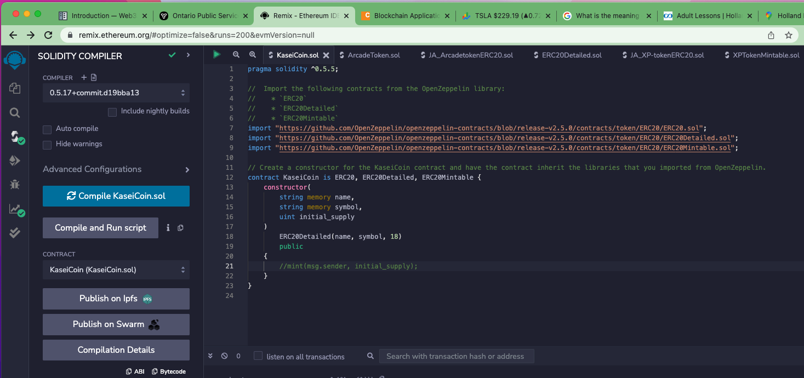

## Step 2: Create the KaseiCoin Crowdsale Contract
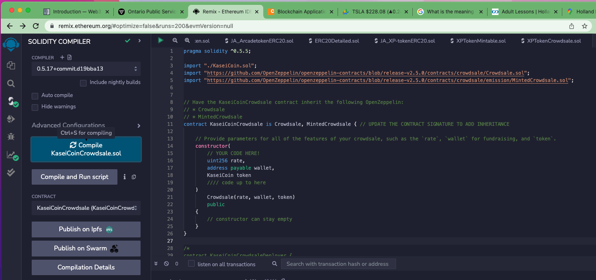
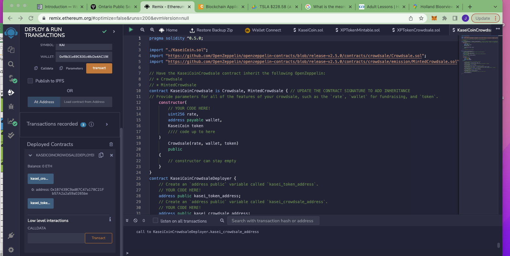
## Step 3: Create the KaseiCoin Deployer Contract

## Step 4: Deploy and Test the Crowdsale on a Local Blockchain

# Deploying Contracts
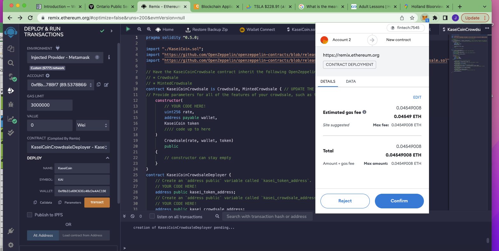
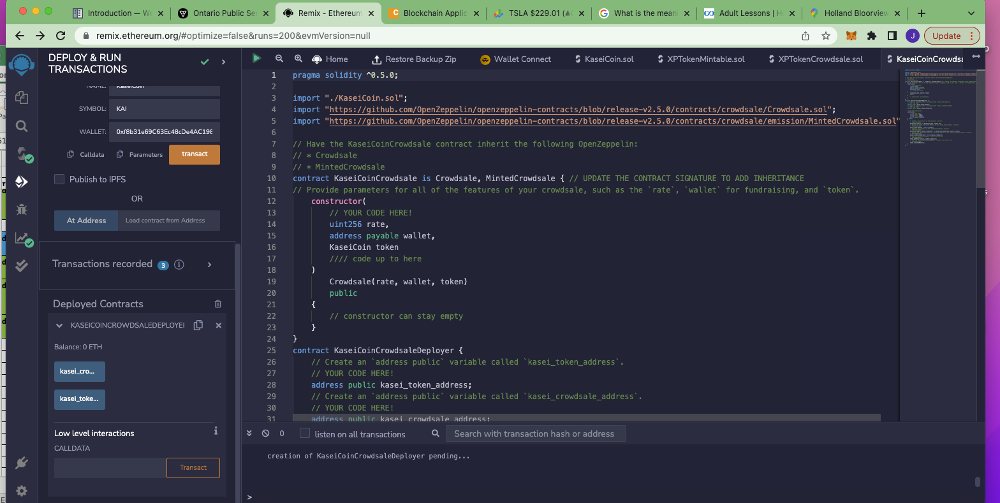
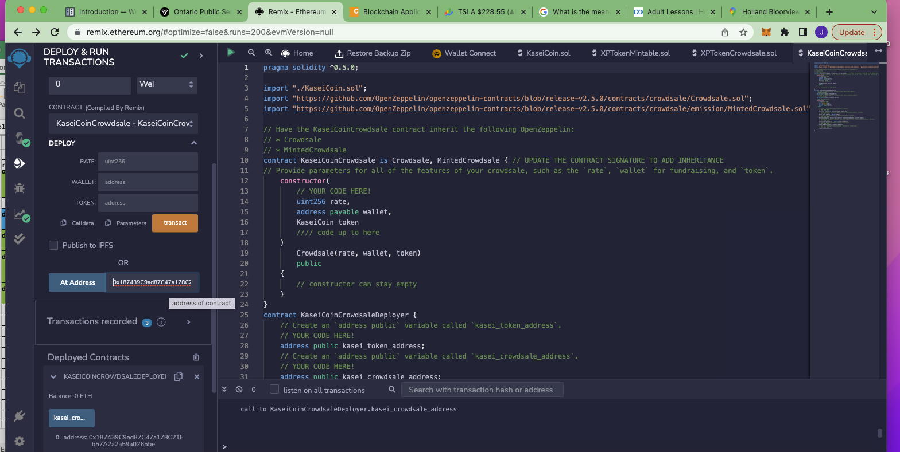
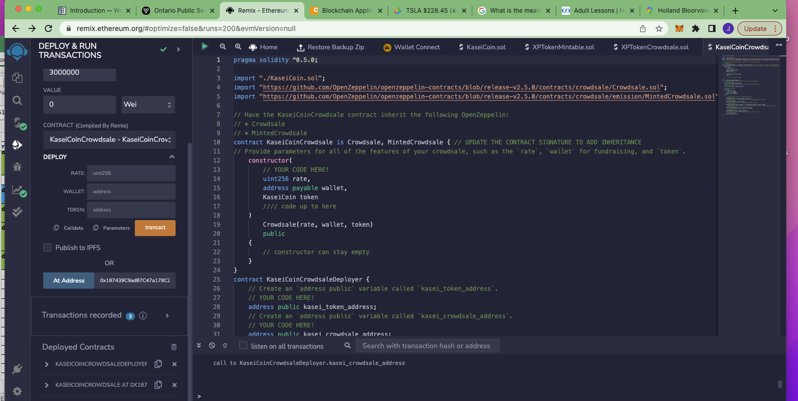
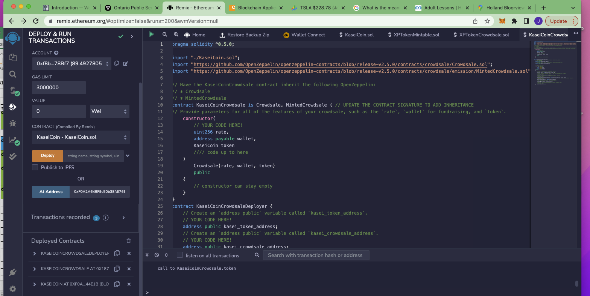

# Testing the functionality 
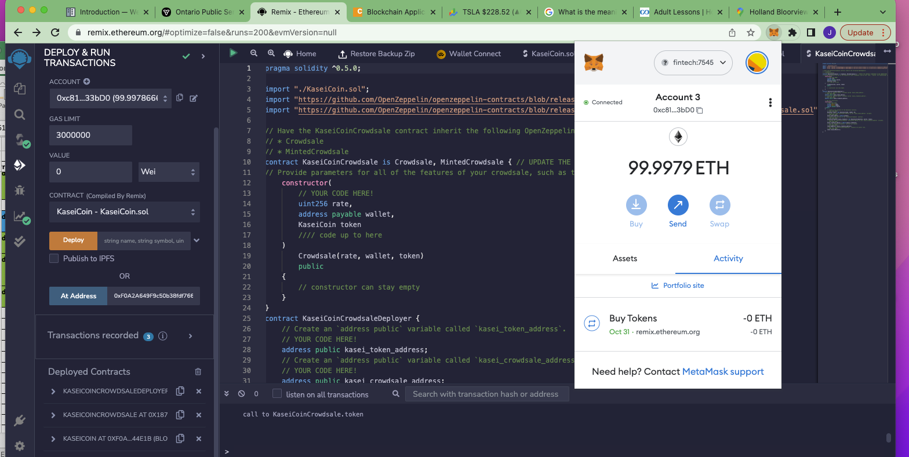
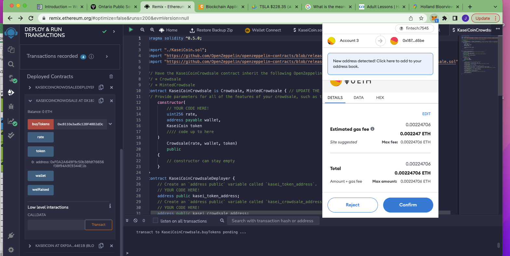
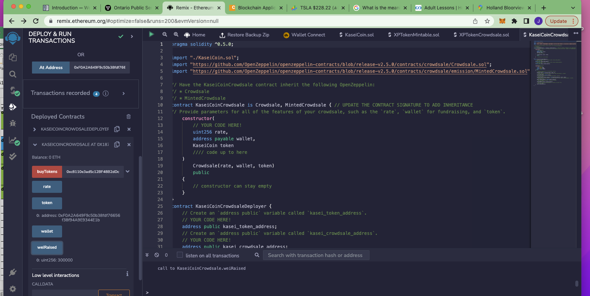
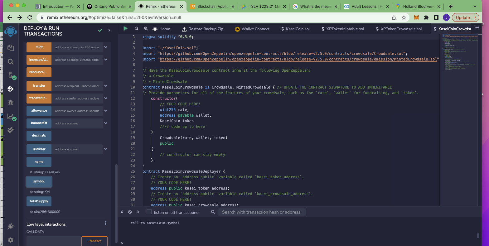

